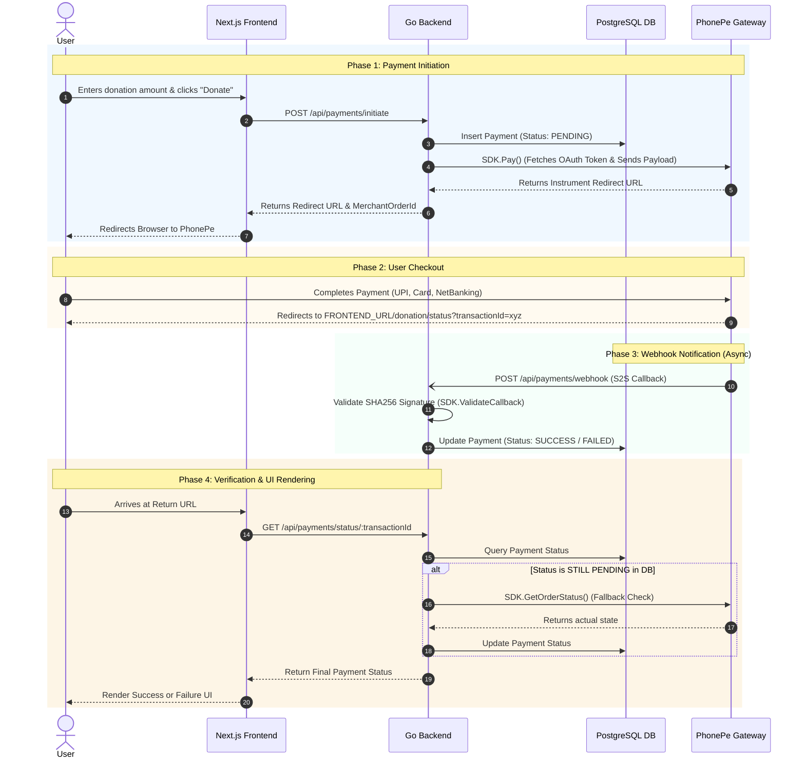

# Payment Flow Architecture

This document visualizes and explains the complete end-to-end payment flow integrated into the Smart Citizen platform using the PhonePe Payment Gateway.

## Sequence Diagram

The following Mermaid sequence diagram outlines the interactions between the User, our Frontend (Next.js), our Backend (Go/Gin), the Database (PostgreSQL), and PhonePe's servers.

## Step-by-Step Explanation

### Phase 1: Payment Initiation
1. The user fills out the donation details and clicks "Donate".
2. The Frontend sends the amount and donor details to the backend's `/initiate` API.
3. The Backend generates a unique `merchantOrderId` and stores a record in the database marked as **`PENDING`**.
4. The Backend uses the PhonePe Go SDK, which automatically fetches the Identity Manager OAuth Bearer Token, generates the `X-VERIFY` checksum, and sends the request to PhonePe.
5. PhonePe returns a secure redirect URL.
6. The Backend passes this URL to the Frontend, which then forcibly redirects the user's browser to the PhonePe checkout page.

### Phase 2: User Checkout
7. The user completes the payment securely on PhonePe's infrastructure.
8. Upon completion (success or failure), PhonePe redirects the user back to the application using the predefined return URL.

### Phase 3: Webhook Notification (Async)
9. At exactly the same time the user is redirected, PhonePe's servers send a server-to-server HTTP POST request to our Backend's `/webhook` endpoint.
10. The Backend validates the cryptographic signature to ensure the webhook isn't spoofed.
11. The Backend updates the database record from `PENDING` to `SUCCESS` or `FAILED`. *(Note: This step happens invisibly in the background).*

### Phase 4: Verification & UI Rendering
12. The user's browser lands on the frontend status page (`/donation/status?transactionId=xyz`).
13. The frontend immediately asks the backend for the final status of this transaction.
14. The backend checks the database. If the webhook already arrived, it simply returns the status. If the webhook was delayed (network issue) and the database still says `PENDING`, the backend forcefully checks PhonePe's status API to resolve the payment state before updating the database.
15. The frontend displays the final confirmation (e.g., "Thank you for your donation!") to the user.
